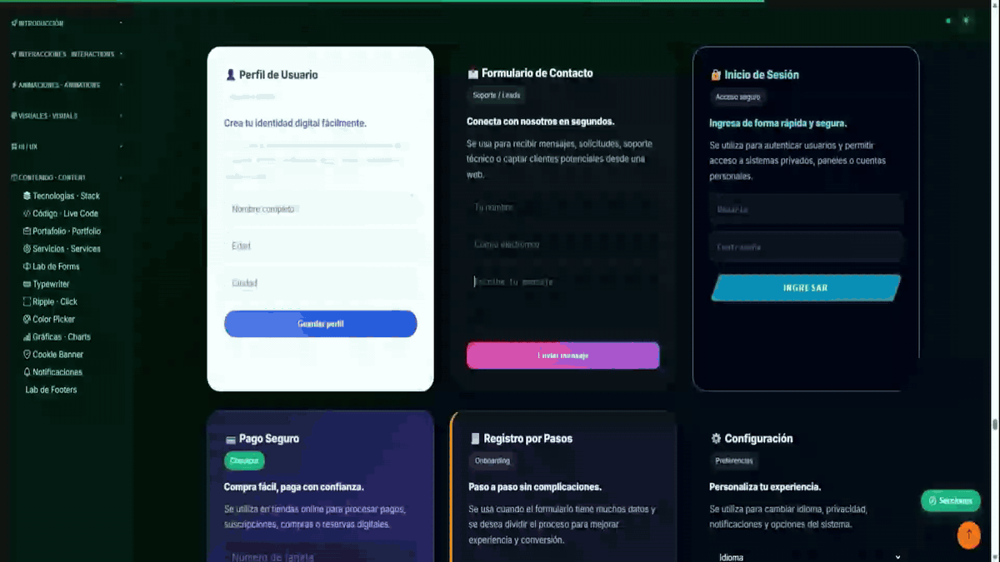

# 🧪 Yurani Lab — Frontend Effects Catalog

> **Laboratorio interactivo de efectos UI, animaciones y experiencias web modernas.**  
> +33 efectos implementados y funcionando en tiempo real.

[](https://gsap.com)

---

## ✨ Vista previa




---

## 🎯 ¿Qué es este proyecto?

Un **catálogo técnico de efectos frontend** construido para demostrar dominio práctico de animaciones, interactividad y diseño de interfaz moderno. Cada sección incluye:

- ✅ El efecto funcionando en tiempo real
- 💡 Explicación del impacto en UX
- 🎯 Casos de uso reales por industria
- 📊 Métricas de resultado esperado

**No es un portfolio estático** — es una herramienta de ventas técnica que demuestra qué puede hacer cada efecto por un negocio real.

---

## 🗂️ Efectos incluidos (+33)

| Categoría | Efectos |
|-----------|---------|
| **Animación de scroll** | Scroll Reveal · Parallax · SVG Path Drawing · Pin & Reveal · Timeline |
| **Interacción** | Cursor Trail (5 modos) · Tilt 3D · Flip Cards · Drag & Drop · Ripple Effect |
| **Texto** | Typewriter · Scramble Text · Glitch Effect · Variable Fonts · Marquee |
| **Visual** | Neon Glow · Galería Lightbox · Scroll Horizontal · Liquid Blob · Skeleton Loading |
| **Datos** | Gráficas animadas · Contadores · Color Picker en vivo |
| **UI Components** | Modal Premium · Cookie Banner · Notification System · Lab de Formularios |
| **Fondo** | Partículas interactivas · Vanta Clouds · Modo oscuro/claro |

---

## 🛠️ Stack técnico

```
Frontend puro — sin frameworks, sin dependencias de build
```

| Tecnología | Uso |
|-----------|-----|
| **HTML5** | Estructura semántica, accesibilidad (ARIA), 33 secciones |
| **CSS3** | Custom Properties, `color-mix()`, animaciones `@keyframes`, modo claro/oscuro |
| **JavaScript ES6+** | Canvas API, IntersectionObserver, clases, módulos IIFE |
| **GSAP 3.12** | ScrollTrigger, ScrollToPlugin, animaciones de alta performance |
| **Chart.js 4.4** | Gráficas de barras, línea, doughnut y radar animadas |
| **Particles.js** | Red generativa de nodos con interacción en tiempo real |
| **Three.js r134** | Escena 3D de fondo con Vanta Clouds |
| **Bootstrap Icons** | Sistema de iconografía consistente |

---

## 🚀 Cómo correrlo localmente

No necesita instalación ni servidor. Solo:

```bash
# 1. Clonar el repositorio
git clone https://github.com/yuranimartinez/lab.git

# 2. Abrir en el navegador
# Doble clic en index.html
# — o —
# Con Live Server en VS Code (recomendado para hot reload)
```

**Estructura del proyecto:**
```
lab/
├── index.html          # Todo el HTML (33 secciones)
├── css/
│   └── styles.css      # +5000 líneas de estilos y temas
├── js/
│   └── script.js       # +2500 líneas de lógica interactiva
├── preview.gif         # GIF demo (agregar manualmente)
└── README.md
```

> ⚡ **Nota de performance:** todas las animaciones de scroll usan `IntersectionObserver` y `ScrollTrigger` con `once: true` para no re-ejecutar fuera del viewport. Los canvas de cursor trail se pausan automáticamente cuando la sección sale de pantalla.

---

## 💡 Por qué este proyecto importa

La mayoría de portfolios frontend muestran diseño. Este muestra **criterio técnico + impacto de negocio**:

- Cada efecto documenta **por qué** mejora la experiencia del usuario
- Los casos de uso están organizados por tipo de cliente (SaaS, e-commerce, clínicas, etc.)
- Demuestra capacidad de comunicar valor técnico a stakeholders no técnicos

---

## 📬 Contacto

**Yurani Martínez** — Frontend Developer

[](https://linkedin.com/in/yuranimartinez)
[](https://github.com/yuranimartinez)
[](https://wa.me/573000000000)

---

## 📄 Licencia

Este proyecto es de uso personal y demostrativo.  
El código puede ser referenciado con atribución. No redistribuir como propio.

---

<div align="center">
  <p>Hecho con 💚 y demasiado café en Medellín, Colombia</p>
  <p><strong>Yurani Martínez · Frontend Developer</strong></p>
</div>
